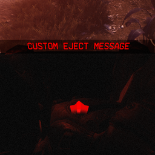

# IMPORTANT - PLEASE READ | Custom Eject Message
> Uses custom localization to set a custom eject message that happens each time

If you really want to set up fast, read §1.2.

## 1. Synopsis
### 1.1. Intro
  
This mod for Titanfall 2 uses the Northstar client & modloader.

### 1.2. Set up
**PLEASE READ:** Open `resource/customem_english.txt` with your code/text editor (e.g. Notepad on
Windows). Replace all of the insides of the double-quotes that say `customem.default` with
what you want the eject message to always be (or you can set each one to be different, but it's up
to you). This can be made easier by using Find and Replace. You can also change the ejection
confirmation prompt (the thing that appears when you press `X`) and what it says after confirmation.

## 2. Purpose
For the Vine

## 3. Contributing
Pull requests welcome :)

## 4. Legal/licensing
This mod is licensed under the BSD 2-clause license -- see `LICENSE`.
